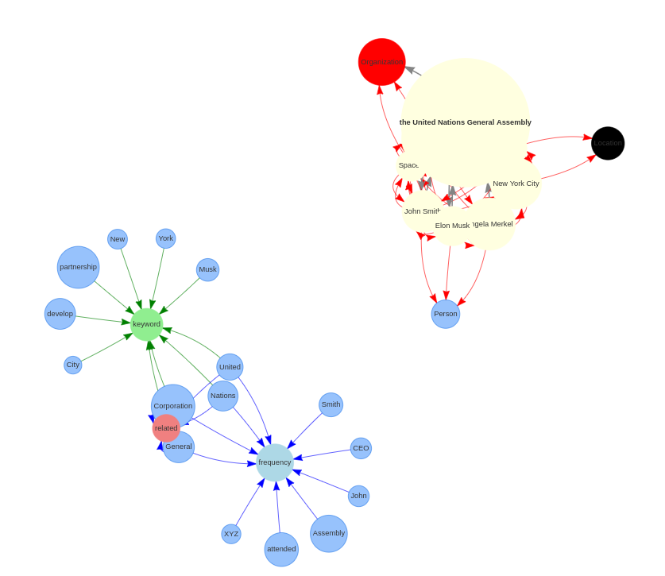

# News Graph

Key information extration from text and graph visilization. Inspired by [TextGrapher](https://github.com/liuhuanyong/TextGrapher).

# Project Introduction

How to represent a text in a simple way is a chanllenge topic. This peoject try to extraction key information from the text by NLP methods, which contain NER extraction, relation detection, keywords extraction, frequencies words extraction. And finally show the key information in a graph way.

# How to use

```python
from news_graph import NewsMining
content = 'Input you text here'
Miner = NewsMining()
Miner.main(content)
```

This will generate the `graph.html`. 

# Example Demo
# Example sentence
1) "In 2022, John Smith, the CEO of XYZ Corporation, attended the United Nations General Assembly in New York City, where he discussed climate change with Angela Merkel, the Chancellor of Germany, and highlighted the company's partnership with SpaceX, headed by Elon Musk, to develop innovative sustainable energy solutions for the future."



2) (IMG.png)
)

3) [EVEN ANONYMOUS CODERS LEAVE FINGERPRINTS](https://www.wired.com/story/machine-learning-identify-anonymous-code/?utm_campaign=Deep%20Learning%20Weekly&utm_medium=email&utm_source=Revue%20newsletter)

